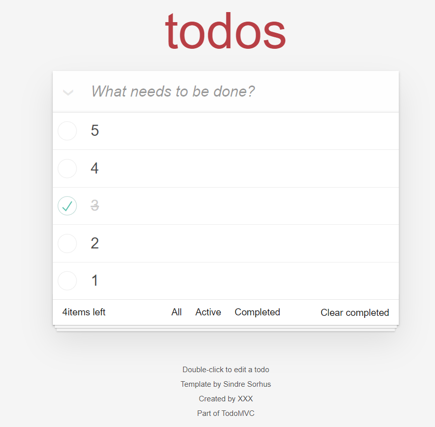

<!--
 * @Date: 2023-07-26 20:36:09
 * @LastEditors: wuyanfeiying
-->
# vue3-todo-list

## vue3入门练习-todoList


## Project setup
```
npm install
```

### Compiles and hot-reloads for development
```
npm run serve
```

### Compiles and minifies for production
```
npm run build
```

### Lints and fixes files
```
npm run lint
```

### Customize configuration
See [Configuration Reference](https://cli.vuejs.org/config/).
